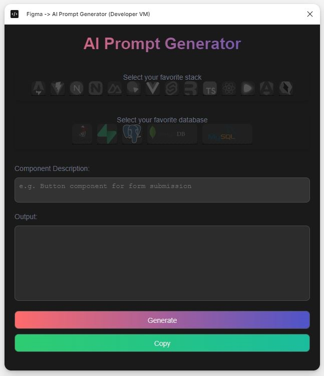

### TypeScript Code for Figma Plugin Overview

This TypeScript code is designed as a Figma plugin to generate a detailed prompt for creating a reusable and performant UI component based on selected nodes within Figma.

#### Key Features:

- **Utility Functions**: 
  - The code includes functions to format numbers, colors, and strings.

- **Helper Functions**: 
  - These extract various style properties from Figma nodes, like:
    - Border width
    - Color
    - Radius

- **WidgetGenerator Function**: 
  - Takes a Figma scene node and generates a prompt string detailing how to create a UI component based on:
    - Node properties
    - Styles

- **Main Function**: 
  - Serves as the entry point for prompt generation.
  - Accepts a scene node and returns a prompt string.

- **Event Listener**: 
  - Listens for messages from the Figma UI. Upon receiving a message, it:
    - Generates a prompt based on the selected nodes.
    - Sends the prompt back to the UI.

#### Generated Prompt Details:

- **Overview**:
  - **Description**: Brief explanation of the component.
  - **Type**: Specifies the kind of widget or component.
  - **Framework**: Indicates which framework (e.g., TypeScript) should be used.
  - **Accessibility**: Ensures components include necessary ARIA attributes.

- **Layout**:
  - **Dimensions**: Size of the component.
  - **Position**: Placement within the design.
  - **Styles**: Visual properties like padding, alignment, and colors.

- **Implementation**:
  - Use of hooks like `useState` for state management.
  - Use of flexbox for layout alignment.
  - Incorporation of ARIA attributes for accessibility.

- **Usage**:
  - Instructions on how to:
    - Include the component in an application.
    - Ensure responsiveness across devices.
    - Maintain accessibility standards.

#### Purpose:

The plugin aids developers in translating Figma designs into high-quality, reusable UI components, streamlining the development process by providing detailed component specifications directly from the design tool.